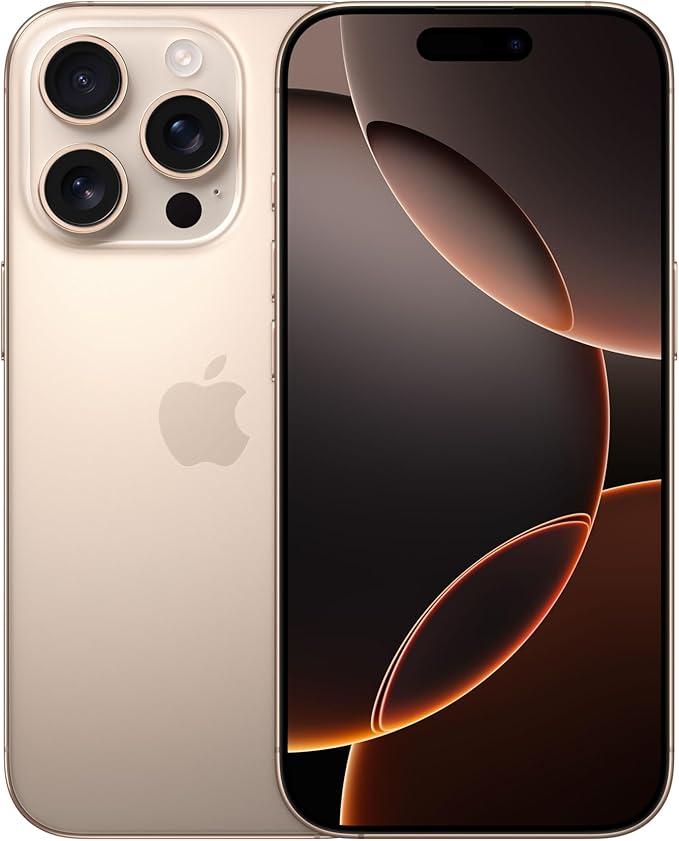

# Инструкции по оптимизации изображений

Для улучшения производительности сайта рекомендуется оптимизировать все изображения. Вот инструкции по оптимизации:

## Рекомендуемые инструменты

1. **TinyPNG** (https://tinypng.com/) - для сжатия PNG и JPEG файлов
2. **Squoosh** (https://squoosh.app/) - для более продвинутой оптимизации
3. **ImageOptim** (для Mac) или **FileOptimizer** (для Windows) - для локальной оптимизации

## Рекомендуемые настройки

### Для иконок устройств (iphone-icon.jpg, samsung-icon.jpg, xiaomi-icon.jpg, honor-icon.jpg)
- Размер: 200x200 пикселей
- Формат: WebP или оптимизированный JPEG
- Качество: 80-85%
- Максимальный размер файла: 30 КБ

### Для favicon.ico
- Размер: 32x32 пикселя
- Формат: ICO
- Включить размеры: 16x16, 32x32, 48x48

## Шаги по оптимизации

1. Скачайте все изображения из папки `images/`
2. Оптимизируйте их с помощью одного из рекомендованных инструментов
3. Замените оригинальные файлы оптимизированными версиями
4. Проверьте, что все изображения отображаются корректно

## Дополнительные рекомендации

- Используйте атрибуты `width` и `height` в HTML для предотвращения сдвига макета
- Рассмотрите возможность использования формата WebP с fallback на JPEG для старых браузеров
- Для фоновых изображений используйте CSS-свойство `background-size: cover` для адаптивности

## Пример HTML с оптимизированными изображениями

```html

<picture>
  <source srcset="images/iphone-icon.webp" type="image/webp">
  
</picture>
``` 